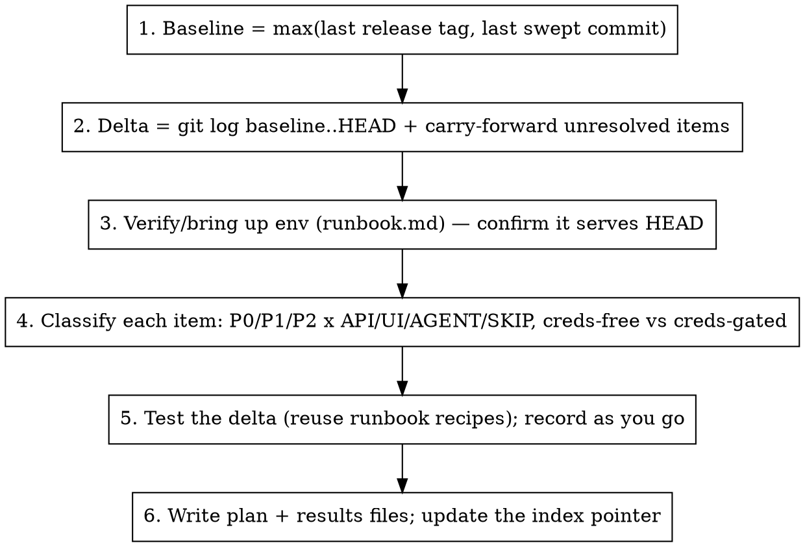

# E2E Coverage Sweep

## Overview

A coverage sweep verifies **everything that changed since a baseline** (a release tag or the last sweep), live, across UI/API/agent layers — and records what passed, failed, or was deferred so the **next sweep is cheaper**.

**Core principle:** every sweep starts from the last sweep. You test the *delta* (new commits + previously-deferred items), reuse a known-good environment recipe, and write results back to a durable ledger. Efficiency compounds: the env setup is recorded once, and covered ground is never re-tested.

For single-feature post-implementation verification, use the `feature-testing` skill instead — this skill is for broad multi-PR passes and reuses feature-testing's per-layer mechanics.

## The trap that costs the most time

**The running containers may NOT be running the code you think they are.** A checked-out branch does not mean the live stack serves it — the containers can be an old image, a detached build, or a stale `dist/`. Testing against the wrong build produces false PASSes and phantom 404s.

**Always verify the live stack before testing anything.** See `runbook.md` → "Verify the stack is running the code under test". This is step 0 of every sweep.

## The efficiency loop

1. **Baseline.** `git tag --sort=-creatordate | head` → last released tag. Find the most recent `docs/testing/*-test-results.md` and its "last swept commit". Baseline = whichever is *newer*. If no prior sweep, baseline = the last release tag.
2. **Delta + carry-forward.** `git log <baseline>..HEAD --oneline`. Open the previous results file and **carry forward** every item still marked `DEFERRED` / `NEEDS-CREDS` / open `FAIL` — recheck whether creds/agents are now available. Items marked `PASS` below the baseline are **not** re-tested.
3. **Verify/bring up env.** Step 0 above — confirm the live stack serves HEAD, then bring up only what's missing. All breeze-specific recipes are in `runbook.md`. Don't rediscover them.
4. **Classify** each delta commit/PR using the legend below. Map each to the layer(s) that can prove it, and mark whether it needs external credentials or a live agent (defer those explicitly — never silently drop them).
5. **Test** the delta. Reuse `runbook.md` recipes (login/JWT, RBAC negative tests, device lookups) and feature-testing's per-layer mechanics. Record each result immediately.
6. **Record.** Write/update the two ledger files and the index pointer (below).

## The coverage ledger

Two files per sweep in `docs/testing/`, plus one living index. Keep the existing format (see `docs/testing/v0.66.1-to-HEAD-*.md` as the reference shape).

| File | Purpose |
|---|---|
| `docs/testing/<baseline>-to-HEAD-test-plan.md` | The classified checklist of delta items (one per PR/commit), P0/P1/P2 + layer tags |
| `docs/testing/<baseline>-to-HEAD-test-results.md` | Results: per-item status + evidence, findings, bugs filed. **Records the "last swept commit".** |
| `docs/testing/e2e-coverage-index.md` | One line per sweep: baseline → results file → last-swept commit. The pointer the next sweep reads first. |

**Status legend** (use these exact tokens so the next sweep can grep them):

- `PASS` — verified live, with evidence.
- `FAIL` — broken; file/track a bug, link it. Stays carried-forward until fixed+reverified.
- `DEFERRED` — testable but not exercised this run (time/data); say why.
- `NEEDS-CREDS` — blocked on external credentials or a live agent (Google/M365 tenant, Win/macOS agent). Carried forward.
- `SKIP` — covered by unit/CI; no manual E2E warranted (dep bumps, internal refactors). Note it; don't silently omit.

**Priority legend:** P0 = security / auth / multi-tenant isolation / data corruption. P1 = user-visible new feature or behavior change. P2 = secondary surface or pre-existing area touched.

## Quick reference

| Need | Command / pointer |
|---|---|
| Last release tag | `git tag --sort=-creatordate \| head` |
| Delta since baseline | `git log <baseline>..HEAD --oneline` |
| Is the live stack serving HEAD? | `runbook.md` → stale-stack verification |
| Bring up local env (caddy + dev mode) | `runbook.md` → bring-up |
| Local login → JWT | `runbook.md` → JWT helper (`admin@breeze.local` / `BreezeAdmin123!`) |
| RBAC negative tests | `runbook.md` → site-scoped `e2e-sitea` user |
| Seed topology (orgs/sites/devices) | `runbook.md` → seed topology |
| curl fails inside a loop? | `runbook.md` → sandbox gotcha (use `/usr/bin/curl`, no loops) |

## Common mistakes

- **Testing against a stale stack.** The #1 false-PASS source. Verify the live build serves HEAD before anything (runbook step 0).
- **Re-testing covered ground.** Read the previous results file first; only test the delta + carried-forward items.
- **Silently dropping creds-gated items.** Mark `NEEDS-CREDS` and carry forward — don't let them vanish from coverage.
- **Using the prod `E2E_*` env creds locally.** Those target `2breeze.app` (often down). Local DB uses `admin@breeze.local` / `BreezeAdmin123!` — see runbook.
- **Trusting a single-org admin to catch tenant bugs.** The seed partner admin is multi-org on purpose; org-resolution bugs only surface with multi-org/multi-site users (runbook → seed topology).
- **Forgetting to write results back.** The ledger is the efficiency engine. No results file = next sweep redoes your work.
