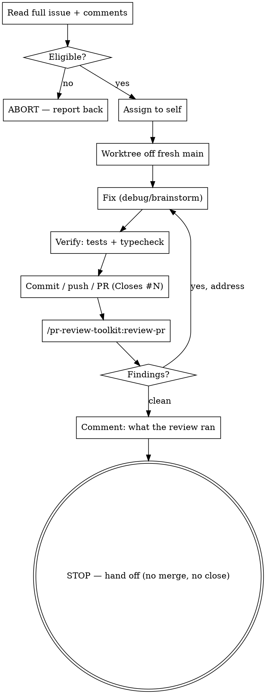

# Issue → PR

## Overview

Execution runbook that carries **one already-chosen GitHub issue** from claim to
a reviewed, open PR. Triage already happened (see `gh-queue`); this skill runs
*after* the decision to work an issue is made.

Repo: `LanternOps/breeze`. Two hard boundaries: **the worker never merges** and
**the worker never closes the issue** — those stay the user's call.

## When to use vs. not

- **Use:** "fix #1234", "take #1234 to a PR", an `issue-fixer` agent picking up a number.
- **Don't use for triage** ("what's waiting on me", "any new issues") → that's `gh-queue`.
- **Don't redefine etiquette** — comment style, never-self-close, and lifecycle
  live in the `github-issues` skill. Follow it; don't restate it.

## The lifecycle



## 0. Select an issue (when you weren't handed a number)

If invoked with a specific issue number, skip to step 1. If asked to "find
something to work on" / "grab an issue off the backlog", select one yourself:

```bash
# Open issues with the signals needed to rank them.
gh issue list --repo LanternOps/breeze --state open --limit 60 \
  --json number,title,assignees,labels,createdAt,comments
```

Rank candidates, best first. **Prefer** an issue that is:

- **Unassigned** (or assigned to you — see the note on "you" in step 1).
- **Actionable without design** — a clear repro, root cause, or file pointers in
  the body/comments. A precise root-cause comment from a maintainer is gold.
- **Bounded** — one component, a contained fix.

**Skip** (don't even open a worktree):

- Anything labeled `tracking`/epic/meta, `needs-design`/`question`/`discussion`/`RFC`.
- Infra firefighting (`ci-red`, broad "X is broken on main") unless explicitly asked.
- Anything that needs a product/pricing/policy decision.

Then run the **step 1 guard on your top candidate** — that's the real gate
(it catches already-shipped fixes and in-flight PRs that ranking can't see). If
the top candidate aborts on the guard, move to the next candidate; repeat until
one passes or the list is exhausted. **Report which issues you considered and
why you skipped each** — don't silently pick one and hide the rest.

When selecting **several** to fan out, cap the count and state the cap.

## 1. Read & guard (do this before touching anything)

```bash
gh issue view N --repo LanternOps/breeze --comments \
  --json number,title,body,state,assignees,labels,comments
# PRs that reference it — ANY state, not just open (a merged/closed PR may have
# already shipped the fix; --state open would never show it).
gh pr list --repo LanternOps/breeze --state all --search "N in:body" \
  --json number,title,state,headRefName,mergedAt
```

Read the **whole** issue and **every** comment. **ABORT and report back** (do
not start work) if any of these is true:

- Issue is **closed**.
- Already **assigned to someone else** (not you, not unassigned). **"You" is the
  operator's GitHub account** — the `@me` login, resolved with
  `gh api user --jq .login` — **not a separate agent identity.** An issue
  assigned to that account is "assigned to you" and is **eligible** (work it);
  only an issue assigned to a *different* login is "someone else" → abort. If
  you're a subagent, you have no GitHub identity of your own, so never read the
  operator's own assigned issues as belonging to a third party.
- **A PR already references it.** An **open** PR → work is in flight, don't
  duplicate. A **merged/closed** PR (or a member comment / commit on `main`
  saying "fixed in #NNN" / "merged to main") → **the fix likely already
  shipped** and the issue is open only awaiting reporter confirmation. Verify
  against `origin/main` before concluding either way — a `gh pr list --state open`
  miss does NOT mean no fix exists. Don't open a duplicate no-op PR.
- It's **too ambiguous or too large** to fix without design — needs a spec or a
  product decision first. Say so; don't guess a fix.

Aborting is a success, not a failure. Report *why* so the orchestrator/user can
decide. Guessing past a guard wastes a worktree and a review cycle.

## 2. Claim

```bash
gh issue edit N --repo LanternOps/breeze --add-assignee @me
```

## 3. Isolated worktree

**REQUIRED SUB-SKILL:** Use `superpowers:using-git-worktrees`. The main working
copy at `/Users/toddhebebrand/breeze` is shared across sessions and drifts —
**verify your base is fresh `main`** before branching (a stale base has nearly
shipped dozens of unrelated commits in a PR).

Branch naming (AGENTS.md — no `codex/` / `claude/` prefixes):
`fix/N-short-slug`, `feat/N-short-slug`, `docs/short-slug`, `chore/short-slug`.

Fresh worktrees need `pnpm install` and the gitignored `.env.test` symlink —
without it RLS forge tests pass vacuously on a BYPASSRLS connection. Prefix
node-pinned commands: `PATH=$HOME/.nvm/versions/node/v22.20.0/bin:$PATH`.

## 4. Fix

- Bug → **REQUIRED:** `superpowers:systematic-debugging` (find root cause before patching).
- Feature/behavior change → `superpowers:brainstorming` first if the issue left design open.
- Touching tenant tables / migrations → follow the RLS shapes + migration rules
  in `CLAUDE.md` (policies in the same migration, idempotent, never edit a
  shipped migration). Touching the Go agent → write to `agent/`, not `apps/agent/`.

## 5. Verify (evidence before "done")

**REQUIRED SUB-SKILL:** `breeze-testing` for what to cover.

- Run the **affected** test files single-fork (the full API suite is flaky in
  parallel — don't trust or trigger a full red run): `pnpm exec vitest run <path>`.
- Type-check touched areas: `npx tsc --noEmit` (and `astro check` if `.astro`
  changed — plain tsc skips Astro files).
- Go changes: `cd agent && go test -race ./internal/<pkg>/...`.

Do not proceed to the ready comment on red tests. **REQUIRED SUB-SKILL:**
`superpowers:verification-before-completion`.

## 6. Commit / push / PR

Use `commit-commands:commit-push-pr` (or do it by hand). The PR body must
include `Closes #N`. PR title follows `fix(scope): summary (#N)` /
`feat(scope): summary (#N)`. Required trailers:

- Commit messages end with: `Co-Authored-By: Claude Opus 4.8 (1M context) <noreply@anthropic.com>`
- PR body ends with the `🤖 Generated with [Claude Code]…` line.

## 7. Review

Run `/pr-review-toolkit:review-pr` on the PR. Address every real finding (loop
back to step 4 → re-verify). Re-run review if you made non-trivial changes.

## 8. Ready signal — comment reports *what the last review ran*

Assignee stays **you**. Post a comment **on the PR** (not the issue) in the
bold-section style (`github-issues` / comment-style conventions). The comment's
job is to record **what the last review run was and its outcome** — NOT a
generic "ready for review" banner.

```markdown
**Review run:** /pr-review-toolkit:review-pr (code-reviewer, silent-failure-hunter, pr-test-analyzer)
**Findings:** 2 raised → both addressed in <sha>; 0 outstanding.
**Tests:** apps/api affected suite green (`vitest run routes/foo.test.ts`, 14 passed); `tsc --noEmit` clean.
**Status:** review-clean, awaiting maintainer merge.
```

If review surfaced nothing, say that explicitly ("0 findings") rather than
omitting the line — a missing line reads as "didn't run it."

## 9. Hand off — STOP

Report the PR number + a one-line summary to the orchestrator/user. Then stop.

**The worker does NOT merge and does NOT close the issue.** Merge (`--admin`,
gated on green required checks) and closure (after the reporter/user verifies)
are the user's judgment calls — see the merge/hold rules. The issue stays
**open and assigned to you** until then.

## Red flags — STOP if you catch yourself

- "It's obviously fixed, I'll just close the issue." → **Never.** Hand off open.
- "Checks are green, I'll merge it." → **Never.** Merge is the user's call.
- "The issue's a bit vague but I'll guess what they meant." → **Abort & ask** (step 1).
- "Someone's assigned but they seem stalled, I'll take it." → **Abort & report** — don't poach. (But an issue assigned to the operator's own `@me` account is *not* poaching — work it; see step 1.)
- "No *open* PR, so nobody's fixed it." → Check **merged/closed** PRs + commits on `main` too. Open-only is a blind spot.
- "I'll skip the worktree, the main copy is fine." → No. Stale base + shared copy = wrong-commit PR.
- "Affected tests pass, skip the rest / skip typecheck." → Run typecheck (and astro check) too.
- "Posting 'ready for review' is enough." → No. Record *which review ran and what it found*.

| Rationalization | Reality |
|---|---|
| "A commit means it's done, close it." | A commit isn't verification. Reporter/user closes. |
| "Green CI means I can merge." | Merge is gated on the user's hold/judgment rules, not just CI. |
| "Aborting wastes the dispatch." | Aborting on a guard is the correct, cheap outcome. Guessing is expensive. |
| "Full suite is red so my change is broken." | The full API suite is flaky in parallel — verify via affected files single-fork. |

## Orchestrating multiple issues

To work several issues at once, the in-session agent acts as orchestrator:

1. Take the **explicit list** of issue numbers (or a label filter the user named).
   Any orchestrator-level eligibility pre-check has the same blind spot as the
   worker's: `gh pr list --state open` won't reveal an already-merged fix, so
   don't pre-declare an issue "eligible" on that basis — the worker's full guard
   (comments + `--state all` + `origin/main`) is the real gate.
2. **REQUIRED SUB-SKILL:** `superpowers:dispatching-parallel-agents` — spawn one
   `issue-fixer` agent per number, each in its **own worktree** (isolation
   prevents branch/DB collisions; see the worktree skill).
3. Each agent runs this runbook independently and returns its PR number (or its
   abort reason).
4. Collect the results into one summary table for the user. The orchestrator
   does **not** merge or close either — same boundary applies.

Do not auto-expand the list beyond what the user named. If you self-selected
from a label, `log`/state the cap and which issues were dropped.
